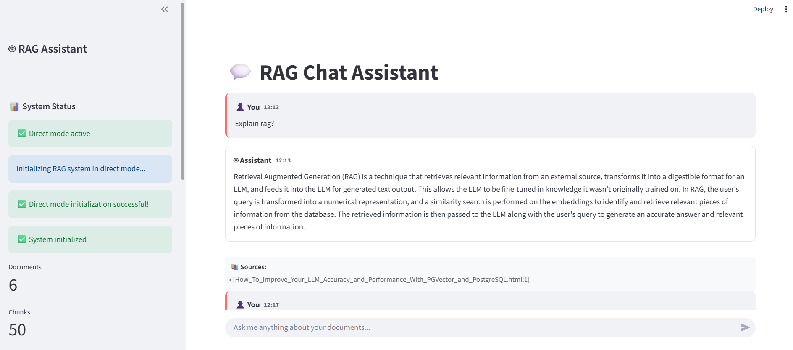
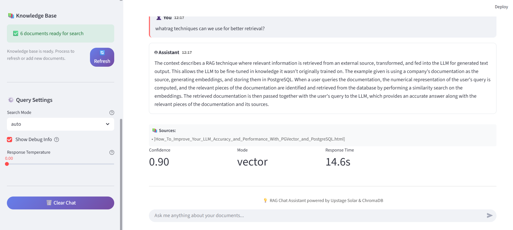
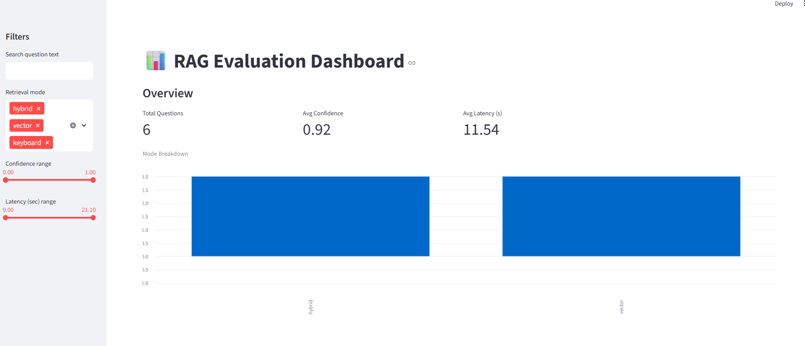
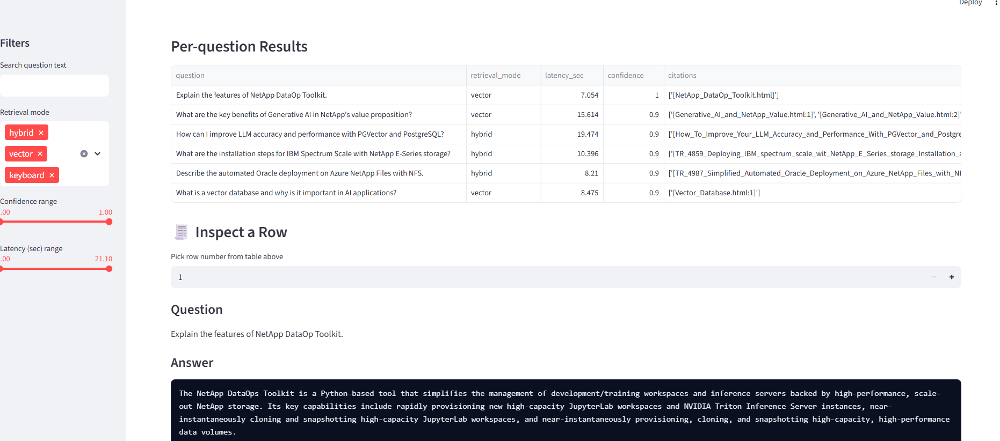
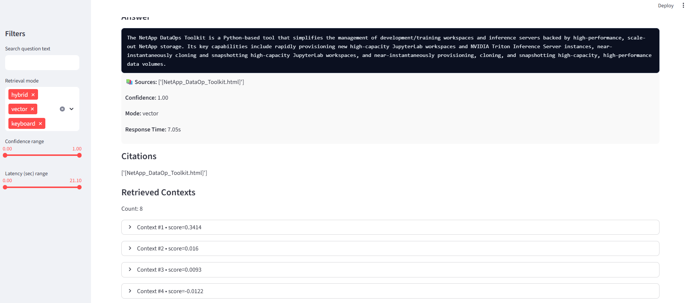

# 🤖 NetApp RAG System

A production-ready **Retrieval-Augmented Generation (RAG)** system built with modern LLM technologies, featuring hybrid search, intelligent document processing, and comprehensive evaluation tools.

## 🌟 Key Features

- **🔍 Hybrid Search**: Combines dense vector search (ChromaDB) with sparse keyword search (BM25)
- **🧠 Advanced LLM Agent**: Multi-step reasoning with LangGraph workflow
- **📄 Smart Document Processing**: HTML, PDF, and text processing with structure-aware chunking
- **💬 ChatGPT-style Interface**: Modern Streamlit UI with real-time responses
- **📊 Comprehensive Evaluation**: Built-in RAG evaluation with interactive dashboard
- **🚀 Production Ready**: FastAPI backend with async processing and caching
- **⚡ High Performance**: Optimized with re-ranking, MMR diversity, and intelligent caching

## 🏗️ Flow Diagram


*Flow Diagram*

## 📸 Screenshots

### Chat Interface

*Modern ChatGPT-style interface with real-time responses and citations*

### System Dashboard

*Real-time system monitoring and document processing status*

### Evaluation Dashboard

*Comprehensive RAG evaluation with metrics and visualizations*

### Document Processing

*Intelligent document processing with chunk management*

### Document Processing

*Intelligent document processing with chunk management*

## 🚀 Quick Start

### Prerequisites

- Python 3.8+
- Upstage API key ([Get one here](https://upstage.ai))

### 1. Installation

```bash
# Clone the repository
git clone <your-repo-url>
cd netapp-rag-system

# Create virtual environment
python -m venv myenv
source myenv/bin/activate  # On Windows: myenv\Scripts\activate

# Install dependencies
pip install -r requirements.txt
```

### 2. Configuration

Create a `.env` file in the project root:

```env
UPSTAGE_API_KEY=your_upstage_api_key_here

# Optional: Customize settings
LLM_MODEL=solar-1-mini-chat
EMBEDDING_MODEL=solar-embedding-1-large-query
MAX_CHUNK_SIZE=500
RETRIEVAL_K=40
FINAL_K=8
DEBUG_MODE=false
```

### 3. Add Your Documents

Place your documents in the `data/raw/` directory:

```
data/
├── raw/
│   ├── document1.html
│   ├── document2.pdf
│   └── document3.txt
└── processed/
    └── (auto-generated)
```

### 4. Run the System

#### Option A: Streamlit Only (Direct Mode)
```bash
streamlit run app.py
```

#### Option B: Full Stack (Recommended)
```bash
# Terminal 1: Start API server
python main.py

# Terminal 2: Start Streamlit UI
streamlit run app.py
```

### 5. Process Documents & Start Chatting

1. Open the Streamlit interface (usually `http://localhost:8501`)
2. Click "🚀 Process" to process your documents
3. Start asking questions about your documents!

## 📚 Usage Examples

### Basic Queries
```
"What are NetApp's AI solutions?"
"How does vector search improve LLM accuracy?"
"Summarize the main features of ONTAP AI"
```

### Advanced Queries
```
"Compare different storage architectures mentioned in the documents"
"What are the best practices for deploying Oracle on Azure NetApp Files?"
"Explain the relationship between embeddings and retrieval quality"
```

## 🔧 System Components

### 🧠 RAG Agent (`agent.py`)
- **Router**: Classifies queries and determines retrieval strategy
- **Retriever**: Hybrid search with dense + sparse methods
- **Synthesizer**: Generates responses using retrieved context
- **Critic**: Evaluates answer quality and detects issues
- **Fallback**: Handles edge cases gracefully

### 📄 Document Processor (`processor.py`)
- **HTML Processing**: Uses Trafilatura + Readability for clean extraction
- **PDF Processing**: PyMuPDF with page-aware chunking
- **Smart Chunking**: Structure-aware with optimal size balancing
- **Metadata Extraction**: File info, source types, and chunk relationships

### 🔍 Hybrid Retriever (`retriever.py`)
- **Dense Search**: ChromaDB with Upstage embeddings
- **Sparse Search**: BM25 with Whoosh/rank_bm25
- **Fusion**: Reciprocal Rank Fusion (RRF) for combining results
- **Re-ranking**: Cross-encoder for relevance refinement
- **Diversity**: Maximum Marginal Relevance (MMR) filtering

### 🌐 API Server (`main.py`)
- **FastAPI**: Async REST API with automatic documentation
- **Caching**: Multi-level caching for embeddings and results
- **Rate Limiting**: Configurable request throttling
- **Health Monitoring**: System status and performance metrics

### 📊 Evaluation System (`evaluate_rag.py`)
- **Automated Testing**: Question/answer evaluation pipeline
- **Metrics**: Confidence, latency, citation quality, keyword coverage
- **Visualizations**: Performance charts and trend analysis
- **Dashboard**: Interactive Streamlit evaluation explorer

## ⚙️ Configuration

### Environment Variables

| Variable | Default | Description |
|----------|---------|-------------|
| `UPSTAGE_API_KEY` | Required | Your Upstage API key |
| `LLM_MODEL` | `solar-1-mini-chat` | LLM model for responses |
| `EMBEDDING_MODEL` | `solar-embedding-1-large-query` | Embedding model |
| `MAX_CHUNK_SIZE` | `500` | Maximum words per chunk |
| `RETRIEVAL_K` | `40` | Initial retrieval count |
| `FINAL_K` | `8` | Final results after re-ranking |
| `DENSE_WEIGHT` | `0.6` | Weight for dense search in hybrid |
| `SPARSE_WEIGHT` | `0.4` | Weight for sparse search in hybrid |

### Advanced Settings

```python
# config.py - Customize these settings
class Config:
    # Chunking
    max_chunk_size: int = 500
    chunk_overlap: float = 0.15
    
    # Search
    retrieval_k: int = 40
    final_k: int = 8
    mmr_lambda: float = 0.5  # Diversity vs relevance
    
    # Quality thresholds
    min_confidence_threshold: float = 0.6
    min_faithfulness_score: float = 0.7
```

## 📊 Evaluation & Monitoring

### Run Evaluation
```bash
# Evaluate system performance
python evaluate_rag.py

# View results in dashboard
streamlit run eval_dashboard.py
```

### Key Metrics
- **Confidence**: Model's confidence in responses (0-1)
- **Latency**: Response time in seconds
- **Citation Quality**: Accuracy and relevance of sources
- **Keyword Coverage**: How well answers address query terms
- **Blended Score**: Overall quality metric

### Performance Monitoring
```bash
# Check system health
curl http://localhost:8000/health

# View processing stats
curl http://localhost:8000/stats
```

## 🧪 Testing

### Run System Tests
```bash
# Comprehensive system validation
python test_system.py

# Check startup requirements
python startup_script.py
```

### Debug Search Quality
```bash
# Debug specific content retrieval
python debug_search.py
```

## 🛠️ Development

### Project Structure
```
netapp-rag-system/
├── agent.py              # RAG agent with LangGraph workflow
├── app.py                # Streamlit chat interface
├── config.py             # Centralized configuration
├── main.py               # FastAPI server
├── processor.py          # Document processing pipeline
├── retriever.py          # Hybrid search implementation
├── evaluate_rag.py       # Evaluation harness
├── eval_dashboard.py     # Evaluation results viewer
├── requirements.txt      # Python dependencies
├── .env                  # Environment configuration
├── data/
│   ├── raw/              # Input documents
│   ├── processed/        # Processed document chunks
│   └── vectorstore/      # ChromaDB persistence
├── eval/
│   ├── questions.jsonl   # Evaluation questions
│   └── out/              # Evaluation results
└── docs/
    └── screenshots/      # Documentation images
```

### Key Dependencies
- **LangChain/LangGraph**: LLM orchestration and workflows
- **ChromaDB**: Vector database for embeddings
- **Streamlit**: Web interface framework
- **FastAPI**: High-performance API framework
- **Sentence Transformers**: Embedding models and re-ranking
- **Trafilatura**: HTML content extraction
- **Upstage**: LLM and embedding APIs

## 🔍 Troubleshooting

### Common Issues

**🚫 "System initialization failed"**
```bash
# Check configuration
python startup_script.py

# Verify API key
echo $UPSTAGE_API_KEY
```

**🚫 "No documents processed"**
```bash
# Check document directory
ls data/raw/

# Manually run processing
python -c "from processor import DocumentProcessor; from config import config; p = DocumentProcessor(config.processed_data_dir); p.process_directory(config.raw_data_dir, True)"
```

**🚫 "Vector search returns no results"**
```bash
# Debug search system
python debug_search.py
```

**🚫 "Slow response times"**
- Reduce `RETRIEVAL_K` and `FINAL_K`
- Enable caching: `ENABLE_CACHING=true`
- Use smaller embedding models

### Performance Optimization

1. **Chunking Strategy**: Adjust `MAX_CHUNK_SIZE` for your content type
2. **Search Parameters**: Tune `DENSE_WEIGHT` vs `SPARSE_WEIGHT` ratios  
3. **Caching**: Enable multi-level caching for production
4. **Model Selection**: Balance model size with performance needs

## 🤝 Contributing

1. Fork the repository
2. Create a feature branch (`git checkout -b feature/amazing-feature`)
3. Commit your changes (`git commit -m 'Add amazing feature'`)
4. Push to the branch (`git push origin feature/amazing-feature`)
5. Open a Pull Request

## 📄 License

This project is licensed under the MIT License - see the [LICENSE](LICENSE) file for details.

## 🙏 Acknowledgments

- **Upstage**: For providing excellent LLM and embedding APIs
- **LangChain**: For the robust LLM orchestration framework
- **ChromaDB**: For the high-performance vector database
- **Streamlit**: For the intuitive web framework
- **NetApp**: For inspiring the use case and document corpus

---

<div align="center">

**Built with ❤️ for intelligent document search and retrieval**

[⭐ Star](your-repo-url) • [🐛 Report Bug](your-repo-url/issues) • [✨ Request Feature](your-repo-url/issues)

</div>


1. .\myenv\Scripts\Activate.ps1
2. pip install -r requirements.txt
3. python main.py
4. Invoke-RestMethod -Uri "http://localhost:8000/ingest" -Method POST -ContentType "application/json" -Body '{"force_reprocess": true}'
5. streamlit run app.py
6. python debug_search.py

# Run evaluation with default questions
python evaluate_rag.py

# Generate evaluation dashboard
streamlit run eval_dashboard.py
